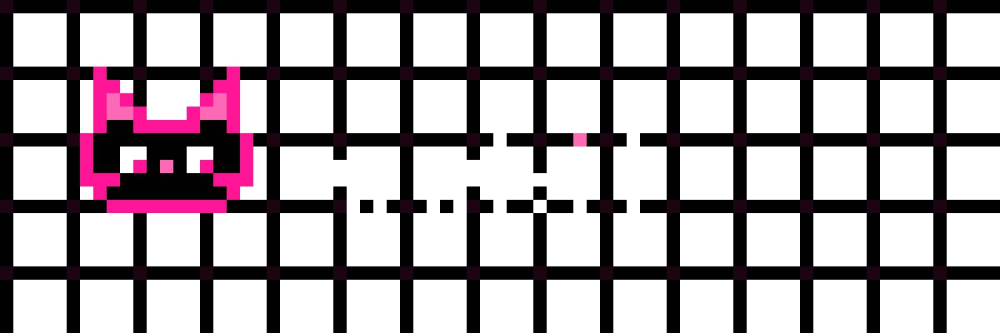

<p align="center">
  
</p>

# vvkit — Verification Harness for Numerical Solvers

[](https://www.python.org/downloads/)
[](LICENSE)
[](https://github.com/astral-sh/ruff)
[](https://mypy.readthedocs.io/)

> **`pytest` proves your code runs. `vvkit` proves your discretization converges at the order you claim.**

`vvkit` is the missing verification framework for computational scientists and numerical solver authors (CFD, thermal-hydraulics, FEM, custom PDE codes). It automates formal code verification through the **Method of Manufactured Solutions (MMS)**, systematic grid refinement sweeps, **Grid Convergence Index (GCI)** estimation per ASME V&V 20, discrete conservation budget checks, and regression baseline drift detection.

---

## Key Features

- **Symbolic MMS Engine**: Automatic derivation of non-trivial source terms $S = L(u_m)$, boundary data, and initial conditions from SymPy PDE operator definitions.
- **Multi-Language Code Emitters**: Automatic code emission of manufactured source terms to **Python**, **C**, and **C++** with mathematical standard library compatibility.
- **Rigorous Order of Accuracy**:
  - Pairwise order and log-log **Least-Squares fit** with standard error and $R^2$.
  - **Roache transcendental root-finding** for non-constant grid refinement ratios $r = h_i / h_j$.
  - **Gauss-Legendre cell-averaging** ($\ge 4$th-order quadrature) to prevent $O(h^2)$ capping on Finite Volume solvers.
- **ASME V&V 20 Compliance**:
  - Grid Convergence Index ($\text{GCI}_{\text{fine}}$) with automatic safety factor selection ($F_s = 1.25$ vs $F_s = 3.0$).
  - Asymptotic range indicator ($R$) and convergence state classification ($R_c$: Monotonic, Oscillatory, Divergent).
  - Round-off error floor detection to exclude noise from asymptotic convergence slopes.
- **Universal Solver Adapters**:
  - `CallableAdapter`: Direct in-process Python solver functions.
  - `CommandAdapter`: External executable solvers driven via Jinja2 templated input files in isolated temporary workdirs.
  - Built-in readers for **NumPy (`.npz`)**, **HDF5 (`.h5`)**, **CSV**, **Text**, and custom callables via entry points.
- **Conservation & Invariant Checks**: Time-series discrete budget closure monitoring to pinpoint the exact time step where conservation departs from round-off bounds.
- **CI-Ready Reporting**: Offline-capable HTML reports, machine-readable JSON contracts (`schema_version: 1`), and JUnit XML for continuous integration pipelines.
- **Pytest Integration**: Native `@pytest.mark.convergence(case="...")` test marker support.

---

## Quickstart

### 1. Installation

```bash
uv add vvkit
```

### 2. Scaffold a Study Configuration

Generate an initial `vvcase.yaml`:

```bash
vv init
```

### 3. Run Verification Study

Execute the study and view results:

```bash
vv run --config-path vvcase.yaml
```

### 4. Advanced: Generate MMS C/C++ Code

```bash
vv mms --config-path vvcase.yaml --language cpp --output src/mms_source.cpp
```

---

## Architecture Overview

```text
vvkit/
  ├── mms/          # Symbolic MMS: operator DSL, source derivation, C/C++/Python emitters
  ├── norms/        # Error norms (L1, L2, Linf), cell-average quadrature, weighting
  ├── convergence/  # Order estimation, Roache iteration, GCI, asymptotic diagnostics
  ├── runner/       # Solver adapters, case matrix expansion, execution pool
  ├── checks/       # Conservation budget closure & invariant checks
  ├── regression/   # Baseline store, tolerance comparison, drift detection
  ├── report/       # Jinja2 HTML templates, matplotlib plots, JSON/JUnit emitters
  ├── config/       # Pydantic models & validation
  └── cli/          # Typer application CLI
```

---

## Interactive Demos & Examples

The framework provides an exhaustive pitch demonstration suite in `examples/demo/`. This suite includes 7 diverse verification cases covering 1D, 2D, and 3D domains, Cartesian, Cylindrical, and Spherical coordinate systems, and linear and non-linear partial differential equations.

For comprehensive documentation on the demonstration suite, including architectural details and execution instructions, please refer to the [Demonstration Suite Documentation](file:///d:/MyProjects/vvkit/examples/demo/README.md).

To run the full demonstration suite and generate verification reports:

```bash
uv run python examples/demo/run_pitch.py --auto
```

The reports will be written to `examples/demo/workdir_{case_name}/reports/`. Open the `.html` files in any web browser to view the convergence plots and diagnostic metrics.

---

## Verification Mathematics & Standard References

- Roache, P. J. (1998). *Verification and Validation in Computational Science and Engineering*.
- Roache, P. J. (2002). "Code Verification by the Method of Manufactured Solutions". *Journal of Fluids Engineering*.
- ASME V&V 20-2009. *Standard for Verification and Validation in Computational Fluid Dynamics and Heat Transfer*.

---

## License

`vvkit` is licensed under the **Apache-2.0 License**. See [LICENSE](LICENSE) for details.
